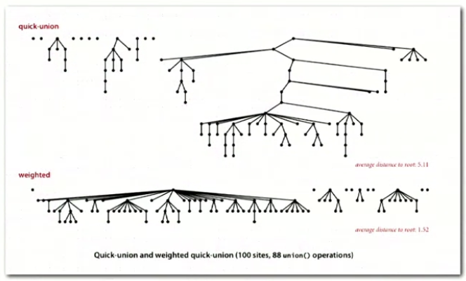
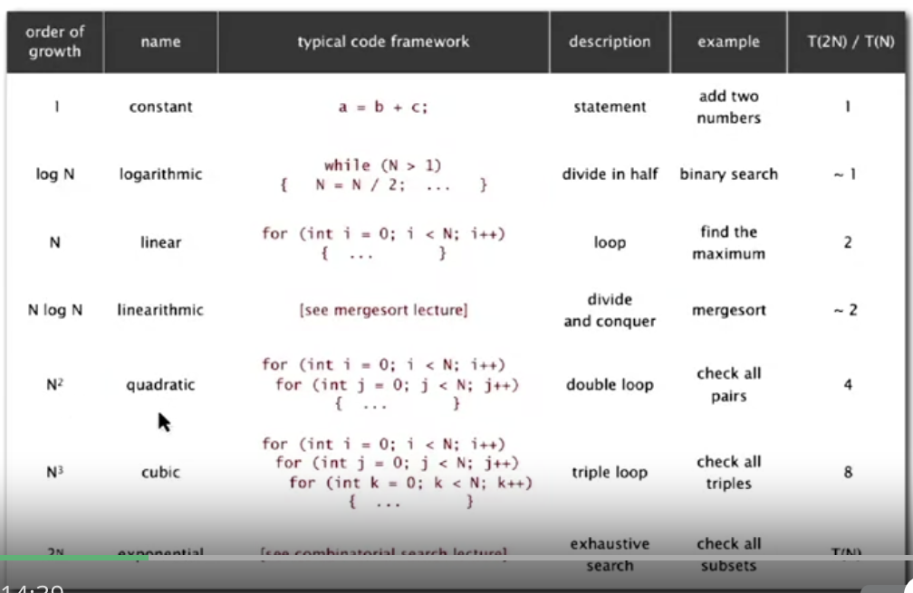

## Notes on Algorithms

*Algorithms: method for solving a problem.*

*Data structure: method to store information.*

*Algorithms + Data Structures = Programs*

## Week 1: Quick Union

Steps to develop a usable algorithm:

1. Model the problem
2. Find an algorithm to solve it
3. Fast enought / fits in memory?
4. If not, figure out why
5. Find a way to address the problem
6. Iterate until satisfied

### Dynamic Connectivity

Is there a path between two objects? Used in many applications. The union-find is a problem of maintaining a collection of disjoint sets and performing two operations.

We need to implement: find query and union command.

Find query: check if two objects are in the same component.
Union: replace components with their union.

We need to check our API design before implementing it.

**Quick Find (eager approach)**:

- Data structure: integer array id[] of size N
- Interpretation: two objects are connected if they have the same ID.

Cost model: numer of array accesses.

Find: check if p and q have the same id.

Union: to merge components containing p and q, change all entries whose id equals id[p] to id[q].

**Quick Union (lazy approach):**

- Data structure: integer array id[] of size N
- Interpretation: id[i] is parent of i
- Root of i is id[id[id[...id[i]...]]]

Find: check if p and q have the same root.

Union: to merge components containing p and q, set the id of p's root to the id of q's root.

Quick-find: union too expensive. Trees are flat.

Quick-union: trees can get tall. Find too expensive (could be N array accesses).

### Improvements

Weighted quick-union

- Modify quick-union to avoid tall trees
- Keep track of size of each tree (number of objects)
- Balance by linking root of smaller tree to root of larger tree

In sumamry, we try to avoid tall trees as we iterate through the array.



```python

class QuickUnion:
    def __init__(self, n):
        self.id = [i for i in range(n)]
        self.sz = [1 for i in range(n)]

    def root(self, i):
        while i != self.id[i]:
            i = self.id[i]
        return i

    def connected(self, p, q):
        return self.root(p) == self.root(q)

    def union(self, p, q):
        i = self.root(p)
        j = self.root(q)
        self.id[i] = j

    def weighted_union(self, p, q):
        i = self.root(p)
        j = self.root(q)
        if i == j:
            return
        if self.sz[i] < self.sz[j]:
            self.id[i] = j
            self.sz[j] += self.sz[i]
        else:
            self.id[j] = i
            self.sz[i] += self.sz[j]
```

**Running time:**

- Find: takes time proportional to depth of p and q
- Union: takes constant time, given roots

Depth of any node x is at most lg N.

### Union-Find Applications

- Games
- Dynamic connectivity
- Percolation

**Percolation**

N by N grid sites. A system percolates iff top and botom are connected by open sites.

Can be thought of as water flowing through surfaces. Or in Social networks if we want to know whether people are connected.

**The subtext of the problem is:**

- We model the problem
- Then we find an algorithm
- We check whether it's fast or not
- We address the problem
- And iterate...

## Week 2: Analysis of Algorithms

The key is running time; we used to have a cranking machine; how many cranks we need to do to compute.

Why analyze algorithms?

- Predict performance
- Compare algorithms
- Provide guarantees
- Understand theoretical basis

One of the most important ones is the FFT algorithm; takes only $N log N$ steps. Another one is the N-body simulation.

We use the scientific method to analyze algorithms: Observe, hypothesize, predict, verify, and validate.

Experiments must be **reproducible** and **falsifiable**.

**3-Sum Example**

How many distinct integers add up to zero.

Brute force: do a triple for loop. (it will take n^3)

**Mathematical models of runtime**

Donald Knuth first proposed the total run-time when programs were running for too long.

E.g., how many instructions as a function of input size N?

Turing said we should just count the most expensive operations instead of each addition.

By focusing on one operation you can simplify the frequency counts.

**Order of growth classifications**

Small set of functions: log N, N, NlogN, N^2, N^3, 2^N



Based on binary search we can find a better algorithm for 3-Sum. We can use N^2 log N instead of N^3.

Instructions:

- Sort the N integers
  - Insertion sort: N^2
- For each pair of integers a and b, binary search for -(a+b)
  - Binary search: log N
- Only count if a[i] < a[j]] < a[k]

### Types of analysis

We have best case, worst case, and average case. Lower bound on cost, upper bound on cost, and expected cost.

We can have different approaches:
1. Design for worst case
2. Randomize the input

The main approach is to reduce variability by focusing on the worst case scenario. We want to find an optimal algorithm.

We have many notations
- Big Theta ($Big \theta$): asymptotic order of growth
- Big Oh: to develop upper bounds
- Big Omega: to develop lower bounds

Example:
- 3 Sum
	- Improved algorithm gives us O($N^2logN$)
	- Lower bound (proof that no algorithm can do better): $\omega(N)$

The approach:
- Develop algorithm
- Prove a lower bound

We can also have tilde notation. It's used to provide an approximate model. 

### Memory

Typical memory usage for primitive types:
- Boolean (1); Char (2); Double (8); Int (8)
- Int[][] ~4MN; int[] ~4N+24; 

Typical memory usage for objects in Java:
- Object overhead 16 bytes
- Ref 8 bytes
- Padding multiple of 8 bytes

## Week 2: Stacks and Queues

### Stacks and queues
- They're fundamental data types
- Stack has push and pop (LIFO)
- Queue has enqueue and dequeue (FIFO)

### Stacks
- push(); pop(); isEmpty()
- We build the stack with a LinkedList
	- push - insert node to the beginning
	- pop - remove node from the beginning

```java
pop()
String item = first.item;
first = first.next;

push()
Node oldfirst = first;
first = new Node();
first.item = "not";
first.next= oldfirst
```

- Every op takes constant time in the worst case.
- A tack with N items uses ~40N bytes.
- Every object in Java has 16 bytes of overhead.

**Alternative Implementation**
- Use array s[] to store N items on stack
- push(): add new item at S[N]
- pop(): remove item from S[N-1]
- Cons: need to define the capacity ahead of time

We have to worry about loitering in Java. To avoid that we need to set the removed item to Null so it can be reclaimed by the garbage collector.

**Resizing arrays implementations**

Q: How can we grow the array?
A: If the array is full, create a new array of twice the size and copy the items. ~3N.

Q: How to shrink array?
A: Wait until the array is one-quarter full. Invariant; if the array is always between 25% and 100%

The worst case for push and pop will be N. 

**Memory:** It uses between 8N and 32N. 

### Tradeoffs
- Linked list: 
	- Every op takes constant time in worst case
	- We need to use extra time and space to deal with the links
- Stack
	- Every op takes constant amortized time
	- Less wasted space

### Queues

**LinkedList**

```
enqueue()

String item = first.item;
first = first.next;
return item;

dequeue()

Node oldlast = last;
Node last = new Node();
last.item ="not";
last.next = null;

oldlast.next = last;
```

### Generics

We have implemented stacks of strings, but what about URLs, Ints, Vans...

We use the generic type name in Java `<Item>`

Java doesn't allow generic array creation. We need to create an array of Objects and pass it to a list of items.

```
s = (Item[]) new Object([Capacity])
```

Q: What to do about primitive types?

Wrapper type: each primitive type has a wrapper object type. Integer is a wrapper type for int.

### Iteration

Design challenge: How can we support iteration over stack items by items.

An Iterable is a method that returns an Iterator. It has methods hasNext() and next()

Why make data structures Iterable? It can helps us write elegant code. Allows us to use `for each statements`

### Week 2: Self Questions
- Why does the stack have contant push and pop time?
  - Because we just need to return the first item or last item in the structure without iterating over its values
- What are advantages of a LinkedList over a stack?
  - Arrays provide immediate access to any item; but we need to know the size on initialization
  - Linked List use space proportional to size but we need a reference to access an item
- When do we use the LinkedList, when do we use the stack
  - Depending on the access patterns and memory consumption; stacks are easy for push/pop but to find items it takes a bit more time. We do have resizing issues.
- What's the time complexity of each one?
- How does Java deal with Generics and Iterators?
- Why is it better to use Iterators? What does that allows us to do?
- What is the origin of LinkedLists?
  - They were initially used by LISP in 1950s as the primary structure for all programs and data. IT presented challenges because they're hard to debug. 
- Why can't we remove an item a O(n) complexity from a Stack?
  - Because we still have to shift all the other positions next to the item removed. This would cost a linear amount of time.

## Week 2: Sorting

**Q:** How does Sort knows how to sort Doubles, Strings, and files without any information?
- We use callbacks: the sort() function calls the object's compareTo method.
- Commonly implemented in other programming languages.

The sort implementation takes a Comparable[] object. Then call the `.compareTo()` code.

Yes, you're right. Let's break down the definitions for each of these properties in the context of a binary relation \( $\leq$ \) on a set \( S \):

1. **Antisymmetry**: 
    - This means that two distinct elements cannot both be "less than or equal to" each other. If they are, they must actually be the same element.
  
2. **Transitivity**: 
    - This captures the intuitive idea that if \( a \) is "less than or equal to" \( b \) and \( b \) is "less than or equal to" \( c \), then \( a \) should also be "less than or equal to" \( c \).
  
3. **Totality (or Completeness)**: 
    - This means that given any two elements in the set, one must be "less than or equal to" the other or vice-versa. This ensures that there are no two elements which can't be compared in the order.

Ex standard order for natural and real numbers, alphabetical orders, chronological orders.

**Comparable API**
- Less than return -1
- Equal return 0
- More than return +1

### Selection Sort

In iteration I, find index min of smallest remaining entry; swap a[I] and a[min]

Algorithm: scans from left to right.

Selection sort uses $~N^2/2$ compares. It takes quadratic time, even if the input is sorted.


### Insertion Sort

In iteration I we swap a[i] with each larger entry to its left. 

To sort a randomly ordered arra with distinct keys, it uses $~1/4 N^2$ compares and $~1/4N^2$ exchanges.

If the array is in reverse order, it has to go all the way back to the beginning; if it's in ascending order, it takes 0 exchanges.

For partially sorted arrays, it takes linear time. An array is partially sorted if the number of inversions is less than some constant cN.


### Shellsort

Move entries more than one position at a time by h-sorting the array. An h-sorted array is h interleaved sorted subsequences. (1959 sorting method)

H-sort is just insertion sort with stride length h. Why do this?
- Big increments -> small subarray
- Small increments -> nearly in order

Which increment sequence to use?
- Powers of two? Powers of two minus one?
- 3x+1? Easy to compute
- Sedgewick: 1,5,19,41...

The worst case number of compares used by shell sort is $O(N^(3/2))$

Shell sort is a simple idea leading to substantial performance gains. It involves very little code, used often in hardware (embedded systems)


### Shuffle sort

- Generate a random real number for each array entry
- Sort using these random numbers as the key; uniformly random permutation

Knuth sort: in iteration I, pick integer r between 0 and I uniformly at random. Then we swap a[I] and a[r].

### Convex Hull

The convex hull of a set of N points is the smallest perimeter fence enclosing the points.


E.g., 
- find shortest path in the plane from s to t avoiding a polygonal obstacle. 
- find the farthest path between two points

Graham scan demo
- Choose point p with smallest y-coordinate
- Sort points by polar angle with p
- Consider points in oder,, discard unless it creates a ccw turn


**Week 3: Self-Questions**
- When should I use which sort?
	- Insertion Sort
	- Select Sort
	- Merge Sort
	- Shell Sort
	- Shuffling
- Why are some sorts better than others in specific occasions?
- What are the most widely used sorts?

## Week 3: Merge Sort

- Divide array into two halves
- Recursively sort each array
- Merge the two halves

Copy to an auxiliary array.
**


Mergesort uses at most NlgN compares and 6NlgN array accesses to sort any array of size N.

Mergesort uses extra space proportions to N.

Practical improvements:
- Use insertion sort for small subarrays; merge sort has too much overhead for tiny arrays
- The cut-off for mergesort is 7 items
- Stop if already sorted; is the biggest item in first half < smallest item in second half

```python
# split in half
m = n / 2

# recursive sorts
sort a[1..m]
sort a[m+1..n]

# merge sorted sub-arrays using temp array
b = copy of a[1..m]
i = 1, j = m+1, k = 1
while i <= m and j <= n,
    a[k++] = (a[j] < b[i]) ? a[j++] : b[i++]
    → invariant: a[1..k] in final position
while i <= m,
    a[k++] = b[i++]
    → invariant: a[1..k] in final position
```

### Bottom-up Merge Sort (no recursion)

Basic plan
- Pass through array merging subarrays of size 1
- Repeat for subarrays of size 2,4,8,16...
- Uses space proportional to the array

### Sorting Complexity

Computational complexity: framework to study efficiency of algorithms to solve problem X.

- Model of computation: allowable ops.
- Cost model: operation counts.
- Upper bound: cost guarantee provided by some algorithm
- Lower bound: Proven limit on cost for all algorithms of X
- Optimal algorithm: best possible cost guarantee (lower bound - upper bound)

**E.g. Sorting**
- Model of computation: decision tree
- Cost model: # of compares
- Upper bound: ~N log N
- Lower bound: ~N log N
- Optimal algorithm: mergesort
	- Optimal with respect to # of compares
	- Not optimal with respect to usage
	- We use theory as guide

### Comparators

We also have a comparator interface to sort using an alternate order. 

`int compare(Key v, Key w)`

E.g., 
- Compare students by name, by section, etc...

```java
Arrays.sort(a, Student.BY_NAME)
Arrays.sort(points, p.POLAR_ORDER)
```

### Stability

A typical application: first sort by name, then by section.

A stable sort is one that presents the same order of items with a given key.

Insertion sort and merge sort are stable (but not selection sort or shell sort)

We can move items past items that are equal.

### Self Questions
- When do we care about stability for sorting
- Why are some algorithms stable and others aren't?

### Week 3: Quick-sort

Basic Plan:
- Shuffle the array
- Partition so that, for some k
	- entry a[j] is in place
	- no larger entry to the left of j
	- no smaller entry to the right of j
- Sort each piece recursively

Summary:
- We keep swapping 2 pointers as long as the left is less than the right
- Once they cross we stop and swap the lo with J

Implementation details:
- Partitioning is in-place: using an extra array can make partitioning easier
- Terminating the loop: tricky to check if pointers cross
- Shuffling is needed for the performance guarantee

Performance:
- Number of compares 1.39 N Log N (39% more than merge sort)
- Worst case is quadratic but not likely 

Properties:
- Quick-sort is an in-place sorting algorithm
- Quick sort is not stable
- We can improve it with median-of-3 and cutoff to insertion sort


### Week 3: Selection Sort

**Goal**: Given an array of N items, find the Kth largest. i.e., return the top K.

Quick Select:
- Partition array so that: entry a[j] is in place
- No larger entry to the left of j
- No smaller entry to the right of j
- Repeat in one subarray, depending on j; finished when j equals k.

3-Way Quick sort (Dijkstra Implementation)
- We have 3 pointers; move the ones less than the value to the left
- Move the ones higher than the value to the right
- We increment the pointer if the value is equal to the current value
- We end up with all values even the duplicates sorted

### Week 3: Applications
- Sort a list of names
- Find the median
- Data compression
- Computer graphics
- Load balancing on a parallel computer 

**Each sort type will have different attributes:**
- Stable
- Parallel
- Deterministic
- Keys all distinct
- Multiple key types
- Linked lists or arrays
- Large or small items
- Is the array randomly ordered
- Do we need a guaranteed performance

System sorts cannot possibly cover all possible algorithms.

### Week 3: Self Questions
- Why does Arrays.sort() Arrays.sort() in Java use mergesort instead of quicksort when sorting reference types?
	- The Java API for Arrays.sort() for reference types requires that it is stable and guarantees nlogn performance. Neither of these are properties of standard quicksort.

## Week 4

### Priority Queues API

Collections:
- Stack
- Queue
- Randomized queue
- Priority queue - remove largest or smallest item

Applications:
- Statistics
- Artificial Intelligence
- Number theory
- Graph searching
- Operating systems - load balancing

Implementation:
- It allows us to find the largest M items in a steam of N items in NlogM (as compared with other data structures that have NM)

The binary heap comes from a complete binary tree. Perfectly balanced except for the bottom level.

Heap-ordered binary tree
- Keys in nodes
- Parent's key no smaller than children's keys


If we insert a key larger than its parents we exchange them until the order is restored. 

To insert into a heap, we add a node at the end then swim it up with at most 1 + lg N compares. AKA Peter principle; promoted to level of incompetence.

If the parent's key becomes smaller than one or both, we figure out which children is higher then exchange them until the order is restored (recursively). AKA better subordinate promoted (power struggle)

To delete the maximum, we exchange root with node at end, then sink it down. At most 2 Log N compares.

Considerations:
- Client does not change keys while they're on the PQ
- Best practice: use immutable keys

Java Note on Immutability: when we use *final* those values can't change once created. 

Immutable: String, Integer, Double, Color, Vector, Transaction...

Why use?
- Simplifies debugging
- Safer 
- Simplifies concurrent programming
- Safe to use as key

*We should make classes immutable as much as possible - Creator of Java*

### Week 3: Heapsort

- We start with an unordered list of numbers; we transform it into a max heap ("heapify")
- Then we replace the item at the root with the last item. Repeating until the size of the heap is greater than 1

**Complexity**
- Best Case: O(n log n)
- Average Case: O(n log n)
- Worst Case: O(n log n)

Significance: In-place sorting algorithm with NlogN worst-case.
- Mergesort: no, linear extra space
- Quicksort, no, quadratic time in worst case
- Heapsort: yes

## Week 4: Symbol Tables

- Insert a value with a specified key
- Given a key, search for the corresponding value

**DNS lookup**
- Insert URL with specified IP address
- Given URL, find corresponding IP address

API Examples
- put
- get
- delete
- contains
- isEmpty
- size
- keys

We associate one value with each key. 

Conventions:
- Values are not null
- Method get() returns null if key not present
- Method put() overwrites old value with new value

Value type: any generic type.
- Assume keys are Comparable: we use compareTo()
- Assume keys are any generic type; use equals() to est equality

Best practices - use immutable types for symbol table keys.
- Immutables in Java: String ,Integer, Double, File...
- Mutable in Java: StringBuilder, java.net, URL, arrays

All Java classes inherit a method equals()
- Reflexive
- Symmetric
- Transitive
- Non-null

### Symbol Table Implementations

**Sequential Search (Unordered LinkedList)**
- Performance
	- Search - N
	- Insert - N
	- Search Hit - N/2
	- Inser - N
- Key Interface
	- equals()

We use a LinkedList in this implementation.

**Binary search in an ordered array**
- Data structure: maintain an ordered array of key-value pairs
- We use a rank helper function to find how many keys < K
- Performance
	- Worst
		- Search - log N
		- Insert N
	- Avg Case
		- Search Hit - log N
		- Inser - N/2
- Key Interface:
	- compareTo()

### Ordered Operations
- We want to be able to do min(); get(); floor(); select(7); ceiling() etc... on a symbol table
- These ops come natural in a binary search operation

We can add more operations to a Symbol Table such as:
- deleteMin()
- deleteMax()
- select()
- rank()
- min() / max()
- ordered iteration

We normally argue against wide interfaces. 


### Binary Search Trees

A BST is a binary tree in symmetric order.

It is either: 
- Empty
- Two disjoint binary trees (left and right)

Each node has a key and every node's key is:
- Larger than all the keys in its left subtree
- Smaller than all the keys in its right subtree

```java

private class Node
{
	private Key key;
	private Value val;
	private Node left, right;
	
	public Node(Key key, Value val)
	{
		this.key = key;
		this.val = val;
	}
}

public Value get(Key key)
{
	Node x = root;
	while (x != null)
	{
		int cmp = key.compareTo(x.key)
		if (cmp < 0) x = x.left;
		else if (cmp > 0) x = x.right;
		else if (cmp == 0) return x.val;
	}
	return null;
}

```


## Week 5: Balanced Search Trees

### 2-3 Search Trees

Allow 1 or 2 keys per node. 2 node equals one key with two children. 3 node equals 2 keys with 3 children.

Every path from root to null has same length. Inorder traversal yields keys in ascending order.

Search:
- Compare search key against keys in node
- Find interval containing search key
- Follow associated link (rec)

Inserting
- We want to keep the 2 key 3 node or 1 key 2 node strategy. Therefore we need to insert and check recursively so that the condition is met across the nodes we changed.
- We may have some temporary 4 nodes; we split them and convert them to 1 key 2 nodes and increase the height by 1
- Splitting a 4 node is a local transformation with a constant number of operations

Tree Height
- Worst case: log N (all 2 nodes)
- Best case: log3N or .631 log N (all 3 nodes)

### Red Black B-Trees

A red-black tree is a binary search tree with one extra bit of storage per node: its color, which can be either RED or BLACK. By constraining the node colors on any simple path from the root to a leaf, red-black trees ensure that no such path is more than twice as long as any other, so that the tree is approximately balanced.

A red-black tree is a binary tree that satisfies the following red-black properties:
1. Every node is either red or black.
2. The root is black.
3. Every leaf (NIL) is black.
4. If a node is red, then both its children are black.
5. For each node, all simple paths from the node to descendant leaves contain the
same number of black nodes.

Time Complexity:
- Search - O(Log N)
- Insert - O(Log N)
- Remove - O(Log N)


Properties:
- No node has two red links connected to it
	- Every path from root to null link has same number of black links
	- Red links lean left


**Search**

Search is the same after as for elementary BST (ignore color). Most other operations are also identical

We now add a boolean color to the class.

```
private class Node {
	Key key;
	Value val;
	Node left, right;
	boolean color;
}
```

**Rotations**

Left rotation:
- Check the node is red
- Orient a temporarily right leaning red link to lean left

Right rotation:
- Orient a left leaning red link to temporarily lean right

Color flip:
- Recolor to split a temporary 4-node

With the operations above, we maintain 1-1 correspondence with 2-3 trees by applying elementary red-black BST operations

Balance: 
- The height of the tree is less than 2 Log N in the worst case.
- Height of the tree is 1.00logN in typical applications


## Geometric Applications of BSTs

Intersection among geometric objects. E.g., 2d orthogonal range search. 

Applications in CAD, games, movies, virtual reality, databases...

Extending ordered symbol table:
- Range search: adding range search btw k1 and k2
- Range count: how many keys between k1 and k2

Geometric Interpretation:
- Keys are point on a line
- Find/count points in a given 1d interval

### Line Segment Intersection

Given N horizontal and vertical line segments, find all intersections.

Sweep-line algorithm:
- x coordinates define events
- h-segment (left endpoint): insert your coordinates into the BST

It takes time proportional to NlogN+R to find all R intersections.

### Kd-Trees

We now have 2 dimensional keys. We want to:
- insert a 2d key
- search for a 2d key
- Range search - find all keys that lie in a 2d range
- Range count - count all keys in a 2d range

Keys are point in the plane. We can find and count the points in a given h-v rectangle.

**Range Search**

Space Time Tradeoff:
- Space: M^2 + N
- Time: 1 + N/M^2

Running time:
- Init N
- Inser 1
- Range search 1 per point range

Problem: Points are not evenly distributed 
- e.g., USA Map


We space partition the trees to represent a recursive subdivision of 2d space
- Grid: divide space into squares
- 2d tree: recursively divide into half-lines

Applications:
- Accelerate render in Doom
- Flight simulators
- Nearest neighbor search
- Astronomical databases


We partition according to the points and their coordinates. We alternate which coordinates we use as the key. E.g., left child go down, right child go up.

Range search:
- Find all point in a query axis aligned rectangle 
	- Check if point in node lies in given rectangle
	- Rec search left/bottom
	- Rec search right/top
- Typical case: R+logN
- Worst case scenario: R+sqrt(N)

**Nearest Neighbor Search**
- Typical case: log N
- Worst case: N
- Algorithm
	- Check dist from point in node to query
	- Rec search left/bottom
	- Rec search right/top
	- Organize so we begin by searching for query point


### Flocking Boids

3 simple rules lead to complex emergent behavior:
- collision avoidance: point away from k nearest boids
- flock centering: point towards the center of mass of k nearest boids
- velocity matching: update velocity to the avg of k nearest boids


**KD trees are a simple data structure for processing k-dimensional data:**
- widely used
- adapts well to high dimensional and clustered data
- discovered by an undergrad in an algorithms class

### 1D Interval Search

Data structure to hold a set of overlapping intervals. 

We want to:
- Insert
- Search
- Delete
- Check for an intersection

E.g., which intervals intersect (9,16)?

Create a BST, each node contains an interval (lo, hi)
- We use the left endpoint as BST key
- Store max endpoint in subtree rooted at node

Search:
- If interval node intersects, return it
- Else if left subtree is null, go right
- Else if max endpoint in left subtree is less than lo, go right
- Else go left


We can use a Red Black BST to guarantee performance of the search.

Most operations have a brute of 1/N; for interval search trees we have Log N for most cases. 

### Rectangle Intersection Problem

Problem: Find all intersections among a set of N orthogonal rectangles. 

Important problem when designing microprocessors. Designing a computer became a geometric problem.

They had specific design rules:
- Some wires cannot intersect
- Certain spacing  needed between diff types of wires
- Debugging: orthogonal intersection search

We sweep a vertical line from left to right. IT takes proportional to N log N + R log N to find R intersections among a set of N rectangles

It reduces the rectangle problem to a 1 dimensional problem.


## Week 6: Hashing

### Hash Tables

Use a hash function that takes the key and reduces it to an array index.

It can cause some issues:
- Computing the hash function
- Equality test: need check whether two keys are equal
- Collision resolution: so many values; we may have 2 values for the same array index

Hashing is a classic space-time tradeoff
- No space limitation - trivial hash function with key as index
- No time limitation - trivial collusion resolution with linear probing

Ideal goal:
- Scramble the keys uniformly to produce a table index
	- Efficiently computable
	- Each table index equally likely for each key

Hashing is widely used in system programming. Hash codes return a 32 bit value.

There are hash codes for each data type: integers, booleans, doubles, and strings.

A recipe for user defined types is:
- Combine each significant field using the 31x + y rule
- If the field is a primitive type, use wrapper type: hashCode()
- If field is null, return 0
- If field is a reference type, use hashCode()

The hash code can be a value between $-2^{31}$ and $2^{31}$. The hash function has an int between 0 and M-1.

Our **main assumption** is that each key is equally likely to hash an int between 0 and M-1. 

## Week 7: Graphs

**Graph**: A set of vertices connected pairwise by edges.

Why graphs? Many applications, broadly useful, challenging branch of computer science and discrete math.


- Path: Sequence of vertices connected by edges.
- Cycle: path whose first and last vertices are the same

Two vertices are connected if there's a path between them.

Some common challenges:
- Is there a path between A and B?
- What is the shortest path?
- Is there a cycle in the graph?
- Is there a cycle that uses each edge exactly once?
- How can we connect all of the vertices?
- What is the best way to connect all the vertices?

**Graph API**

```
Graph(int V)
Graph(In in)
void addEdge(int v, int w)
Iterable<Int> adj(int v) - vertices adjacent to v
int V() - num of vertices
int E() - nuim of edges
String - toString()
```

The most widely used representation of graphs is the adjacency-list graph representation.


We use a data structure of type: `Bag<Integer> [] adj;`. To create the graph we use `adj[v]`. 

To add edges we use `adj[v].add(w)` and `adjust[w].add(v)`

