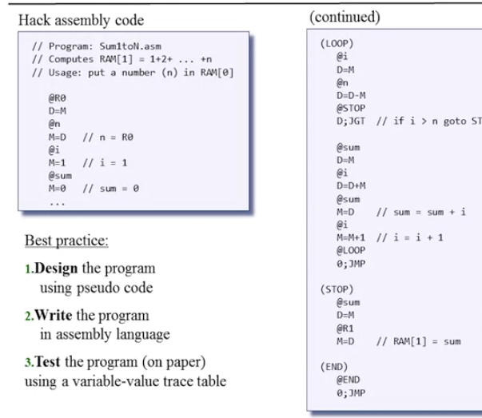
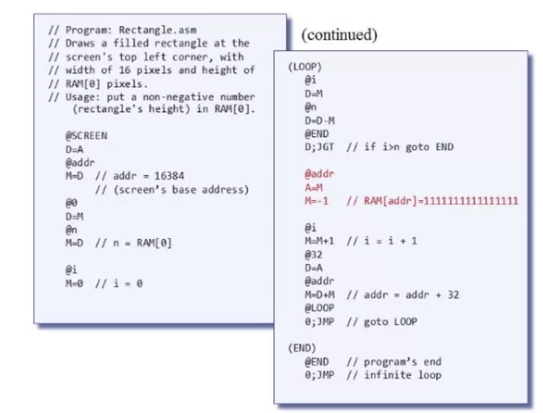

## Nand to Tetris - Coursera Notes

Machine Language: Overview

It needs to tell the hardware what to do (operations), it needs to know which instruction to perform at a given space of time, and it needs to tell the hardware what to operate on (addressing).

Rarely people write in machine language; too complicated; people would rather program in higher level languages.

```
Instruction: 010001000110010

Translates to: ADD R3 R2
```

A symbolic assembler can translate "index" to Mem[129]

Machine Language Elements

- What are the supported ops
- What do they operate on
- How is the program controlled

Machine Operations:

- Usually correspond to what's in the hardware
  - Arithmetic operations
  - Logical operations
  - Flow control ("go to instruction X")

### Memory

- Accessing a memory location is expensive: need to supply a long address.
- Solution: Memory Hierarchy
  - Registers; inside of the CPU
    - Data registers (R0, R1, R2)
    - Address registers (ARO, AR1, AR2)
  - We have fast memory close to the CPU (cache)
  - Main memory, slower, but bigger
  - Disk, slower, but bigger

### Addressing Modes:

- Register: Add R1, R2
- Direct: Add R1, M[200]
- Indirect: Add R1, @A
- Immediate: Add R1, 5

### Control Flow

- Sometimes we need to jump unconditionally to another location. We need to provide the address of the location
- Sometimes we have conditional jumps

```
JGT R1,0, cont // Jump if R1>0
Subtract R1, 0 R1 // R1 <- (0-R1)
```

### The Hack Computer

A 16-bit machine consisting of:

- Data memory (RAM) sequences of 16 bit registers
- Instruction memory (ROM) - read only memory
- CPU for the instructions
- Instruction buses

Hack machine language contains:

- 16-bit A instructions
- 16-bit C instructions

The hack machine recognizes:

- D registers
- A registers
- M registers (register addressed by A)

The A instructions:

```
@value
- Non negative decimal constant

Sets the A register to a value; it becomes the selected RAM registers

E.g., @21

// Set RAM[100] to -1
@100 // A=100
M=-1 // RAM[100] = -1
```

The C instructions:

```
dest = comp; jump (both dest and jump are optional)

comp = 0,1,-1!D,!A,M-1
dest = null, M , D, MD, AM
jump = null, JGT, JEQ, JGE, JLT, JNE


E.g.,
// Set RAM[300] to the value of the D register minus 1
@300
M=D-1

// IF (D-1==0) jump to another instructions in ROM[56]
@56 // A=56
D-1; JEQ // If (D-1==0); go to 56
```

Binary syntax:

```
dest = comp; jump

1 1 1 a c1 c2 c3 c4 c5 c6 d1 d2 d3 j1 j2 j3
```

Each instruction for c is represented in a table with computations. We match them to the symbol table. Same with the destination; we have a set of possible destinations.

### Handling Input and Output

i.e., Keyboard and Screen; enter and display outputs

High level: use libraries enabling them.
Low level: bits.

**Screen**

We have a screen memory map. A designated area dedicated to manage a display unit. The display is refreshed from the memory map many times per second. The output is effected by writing code that manipulates the screen.

We have a table 256 by 512 b/w. We either turn the pixel on or off. Each bit value maps to the actual pixel.

When accessing memory we can only 16 bits in a chunk. To set pixels on or off.

`i=32*row+col/16`

```
1. word = Screen[32*row + col/16]
2. word = RAM[16384 + 32*row + col/16]
3. Set the (col%16)nth bit of word to 0 or 1
4. Commit the word to RAM
```

**Keyboard Memory Map**

When a key is pressed the key scan code appears in the keyboard memory map.

### Low Level Programming

Working with registers and memory:

- D: Data registers
- A: address
- M: currently selected, M=RAM[A]

```
// D = 10
@10
D=A

// D++
D=D+1

// D=RAM[17]
@17
D=M
```

The assembly language ignores blank spaces.

```
@0
D=M

@1
D=D+M

@2
M=D
```

To prevent further instructions from happening, we call an infinite loop.

e.g.,
`@6 0;JMPT`

We have a set of built-in symbols, the below are virtual registers:

symbol|value
R0|0
R1|1
R2|2
R3|3

## Other Features

- Branching
- Variables
- Iterative Processing

**Branching**

```
...
```

**Variables**

```

@R1
D=M
@temp
M=D //TEMP=R1

@R0
D=M
@R1
M=D

@temp
D=M
@R0
M=D //R0=TEMP

(END)
@END
0;JMP

```

**Iterative processing**



Best practices:

1. Design the program using pseudo code
2. Write the program in assembly
3. Test the program on paper using a table of values

**Pointers**

Variables that store the address of array and i are called pointers. Whenever we access something with a pointer we need to use A=M.

```machine
// for (i=0; i<n; i++) {
//  arr[i] = -1
//}

// if (i==0) goto END
@i
D=M
@n
D=D-M
@END
D;JEQ

// RAM[arr+i] = -1
@arr
D=M
@i
A=D+M
M=-1

// i++
@i
M=M+1

@LOOP
0;JMP

(END)
@END
0;JMP
```

**Input/Output**

IO devices are connected to designated areas in the RAM.

We call them SCREEN and KB in the memory map.



Keyboard: Each key is connected to a particular memory address. We just need to say @KBD.

If the register contains 0; no key. Otherwise the register contains the scan code of the pressed key.

_Any program can be presented in the low level language_
